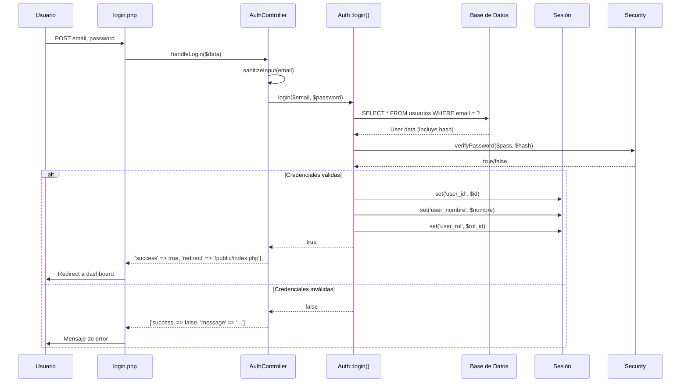
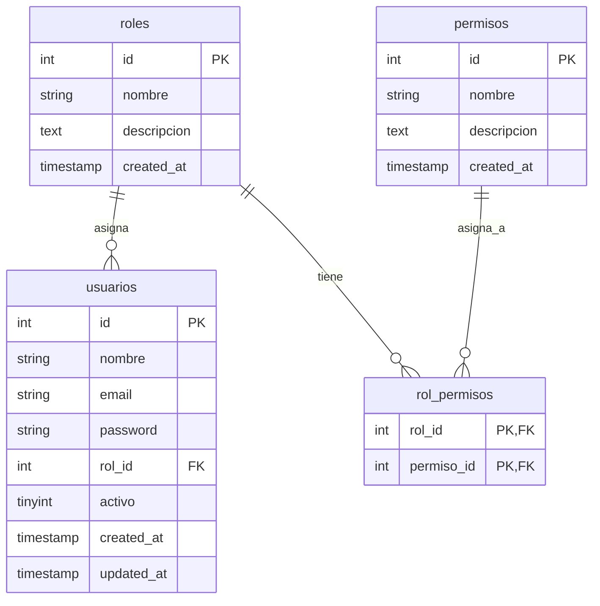

# 📚 DOCUMENTACIÓN TÉCNICA Y FUNCIONAL
# Sistema de Autenticación y Control de Acceso
# **Consejo Campesino Santa Bárbara**

---

## 📖 ÍNDICE GENERAL

1. [INTRODUCCIÓN Y ARQUITECTURA](#1-introducción-y-arquitectura)
2. [DOCUMENTACIÓN TÉCNICA DETALLADA](#2-documentación-técnica-detallada)
   - 2.1. Capa de Configuración
   - 2.2. Capa Core del Sistema
   - 2.3. Capa de Modelos de Datos
   - 2.4. Capa de Controladores
   - 2.5. Capa de Vistas y Presentación
   - 2.6. Capa de Seguridad
3. [DOCUMENTACIÓN FUNCIONAL](#3-documentación-funcional)
   - 3.1. Roles y Permisos
   - 3.2. Flujo de Autenticación
   - 3.3. Flujo de Registro
   - 3.4. Casos de Uso
4. [GUÍA DE INSTALACIÓN Y DESPLIEGUE](#4-guía-de-instalación-y-despliegue)
5. [MANUAL DE USUARIO](#5-manual-de-usuario)
6. [API REFERENCE](#6-api-reference)
7. [MECANISMOS DE SEGURIDAD](#7-mecanismos-de-seguridad)
8. [MEJORAS FUTURAS Y ROADMAP](#8-mejoras-futuras-y-roadmap)
9. [APÉNDICES](#9-apéndices)

---

## 1. INTRODUCCIÓN Y ARQUITECTURA

### 1.1. Descripción General

El **Sistema de Autenticación y Control de Acceso** para el Consejo Campesino Santa Bárbara es una aplicación web desarrollada en **PHP Vanilla (puro)** sin dependencias de frameworks externos, diseñada para proporcionar una base sólida, segura y escalable para la gestión de usuarios, roles y permisos.

**Características Principales:**
- 🔐 Autenticación de usuarios segura con hash de contraseñas bcrypt
- 👥 Sistema de roles y permisos basado en políticas (Policy-based)
- 🛡️ Protección contra XSS, CSRF y ataques comunes
- 🎨 Interfaz responsive y limpia con CSS moderno
- 🔧 Arquitectura modular y extensible
- 📦 Patrón Singleton para la conexión a base de datos
- 🗂️ Separación de responsabilidades (MVC simplificado)

### 1.2. Arquitectura del Sistema

El sistema sigue una arquitectura **MVC simplificada** con cinco capas principales:

```
┌─────────────────────────────────────────────────────────────┐
│                    CAPA DE PRESENTACIÓN                      │
│  (Vistas HTML, CSS, JS - /public, /views)                   │
├─────────────────────────────────────────────────────────────┤
│                   CAPA DE CONTROLADORES                      │
│  (Lógica de negocio - /controllers)                         │
├─────────────────────────────────────────────────────────────┤
│                     CAPA DE MODELOS                         │
│  (Acceso a datos - /models)                                 │
├─────────────────────────────────────────────────────────────┤
│                       CAPA CORE                             │
│  (Servicios principales - /core)                            │
├─────────────────────────────────────────────────────────────┤
│                   CAPA DE CONFIGURACIÓN                      │
│  (Constantes y settings - /config)                          │
└─────────────────────────────────────────────────────────────┘
                         │
                         ▼
              ┌──────────────────┐
              │  MariaDB/MySQL   │
              │  Base de Datos   │
              └──────────────────┘
```

**Patrones de Diseño Implementados:**
- **Singleton**: Para la conexión a base de datos (`Database::getInstance()`)
- **Factory**: En la creación de objetos de controladores
- **Template Method**: En las vistas con header/footer
- **Strategy**: En la validación de permisos

---

## 2. DOCUMENTACIÓN TÉCNICA DETALLADA

### 2.1. CAPA DE CONFIGURACIÓN

#### 2.1.1. `/config/config.php`

Archivo central de configuración del sistema. Define constantes globales que controlan el comportamiento de la aplicación.

```php
define('APP_NAME', 'Consejo Campesino Santa Bárbara');
define('APP_URL', 'http://localhost/consejo_campesino_santa_barbara');
define('TIMEZONE', 'America/Caracas');
define('PASSWORD_MIN_LENGTH', 8);
define('SESSION_NAME', 'consejo_session');
define('ROLE_ADMIN', 1);
define('ROLE_USUARIO', 2);
```

**Constantes y Propósito:**

| Constante | Valor | Propósito |
|-----------|-------|-----------|
| `APP_NAME` | "Consejo Campesino Santa Bárbara" | Nombre de la aplicación para UI y títulos |
| `APP_URL` | "http://localhost/..." | URL base para construcción de rutas absolutas |
| `TIMEZONE` | "America/Caracas" | Zona horaria para fechas y horas del sistema |
| `PASSWORD_MIN_LENGTH` | 8 | Longitud mínima de contraseñas |
| `SESSION_NAME` | "consejo_session" | Nombre de la cookie de sesión |
| `ROLE_ADMIN` | 1 | ID fijo del rol Administrador |
| `ROLE_USUARIO` | 2 | ID fijo del rol Usuario Básico |

#### 2.1.2. `/config/database.php`

Configuración específica de la base de datos MariaDB/MySQL.

```php
define('DB_HOST', 'localhost');
define('DB_NAME', 'consejo_campesino');
define('DB_USER', 'reidy');
define('DB_PASS', 'reidy');
define('DB_CHARSET', 'utf8mb4');
```

**Seguridad Importante:**
- En producción, usar credenciales seguras y no la cuenta `root`
- Considerar usar variables de entorno (`.env`) para almacenar credenciales
- El charset `utf8mb4` soporta emojis y caracteres especiales

---

### 2.2. CAPA CORE DEL SISTEMA

#### 2.2.1. `/core/Database.php` - Patrón Singleton

**Propósito:** Gestiona la conexión única a la base de datos usando el patrón Singleton para evitar múltiples conexiones innecesarias.

```php
class Database {
    private static $instance = null;
    private $pdo;
    
    private function __construct() {
        try {
            $dsn = "mysql:host=" . DB_HOST . ";dbname=" . DB_NAME . ";charset=" . DB_CHARSET;
            $options = [
                PDO::ATTR_ERRMODE            => PDO::ERRMODE_EXCEPTION,
                PDO::ATTR_DEFAULT_FETCH_MODE => PDO::FETCH_ASSOC,
                PDO::ATTR_EMULATE_PREPARES   => false,
            ];
            $this->pdo = new PDO($dsn, DB_USER, DB_PASS, $options);
        } catch (PDOException $e) {
            die("Error de conexión: " . $e->getMessage());
        }
    }

    public static function getInstance() {
        if (self::$instance === null) {
            self::$instance = new self();
        }
        return self::$instance;
    }

    public function getConnection() {
        return $this->pdo;
    }
}
```

**Métodos Públicos:**
- `getInstance()`: Devuelve la única instancia de la clase
- `getConnection()`: Devuelve el objeto PDO para ejecutar consultas

**Ventajas del Singleton:**
- ✅ Una única conexión por petición HTTP
- ✅ Ahorro de recursos del servidor
- ✅ Centralización de la lógica de conexión
- ✅ Fácil mantenimiento y testing

#### 2.2.2. `/core/Session.php` - Gestión Segura de Sesiones

**Propósito:** Wrapper seguro para gestionar sesiones PHP con configuraciones de seguridad hardcodeadas.

```php
class Session {
    public static function start() {
        if (session_status() === PHP_SESSION_NONE) {
            ini_set('session.name', SESSION_NAME);
            ini_set('session.cookie_httponly', 1); // No accesible por JavaScript
            ini_set('session.use_only_cookies', 1); // Solo cookies, no URL
            ini_set('session.cookie_secure', 0); // Cambiar a 1 en HTTPS
            session_start();
        }
    }
    // ... métodos para set, get, remove, destroy
}
```

**Métodos Públicos:**
- `start()`: Inicia sesión con configuraciones seguras
- `set($key, $value)`: Almacena un valor en sesión
- `get($key)`: Recupera un valor (null si no existe)
- `remove($key)`: Elimina una variable de sesión
- `destroy()`: Destruye toda la sesión
- `has($key)`: Verifica si existe una clave

**Configuraciones de Seguridad:**
- `httponly = 1`: Previene acceso a cookies desde JavaScript (XSS)
- `use_only_cookies = 1`: Evita que el ID de sesión pase por URL
- `cookie_secure = 0`: **IMPORTANTE** Cambiar a 1 en producción con HTTPS
- `SESSION_NAME` personalizado evita nombres predictibles

#### 2.2.3. `/core/Security.php` - Sanitización y Cifrado

**Propósito:** Centraliza todas las operaciones relacionadas con seguridad y encriptación.

```php
class Security {
    public static function sanitizeInput($data) {
        return htmlspecialchars(trim($data), ENT_QUOTES, 'UTF-8');
    }

    public static function hashPassword($password) {
        return password_hash($password, PASSWORD_DEFAULT);
    }

    public static function verifyPassword($password, $hash) {
        return password_verify($password, $hash);
    }
    // ... métodos CSRF
}
```

**Métodos Públicos:**
- `sanitizeInput($data)`: Sanitiza datos para prevenir XSS
- `hashPassword($password)`: Cifra contraseñas con bcrypt (costo automático)
- `verifyPassword($password, $hash)`: Verifica contraseñas contra hash
- `generateToken()`: Genera token CSRF seguro (32 bytes aleatorios)
- `verifyCSRFToken($token)`: Verifica token CSRF con `hash_equals()` (timing attack safe)

**Best Practices Implementadas:**
- ✅ `password_hash()` con `PASSWORD_DEFAULT` (bcrypt actualmente)
- ✅ `htmlspecialchars()` con `ENT_QUOTES` y UTF-8
- ✅ `hash_equals()` para comparación segura de strings
- ✅ `random_bytes()` para generación criptográficamente segura

#### 2.2.4. `/core/Auth.php` - Motor de Autenticación

**Propósito:** Corazón del sistema. Gestiona login, logout, sesiones y verificación de permisos.

```php
class Auth {
    private $db;
    
    public function __construct() {
        $this->db = Database::getInstance()->getConnection();
    }

    public function login($email, $password) {
        $stmt = $this->db->prepare("SELECT id, nombre, email, password, rol_id FROM usuarios WHERE email = ?");
        $stmt->execute([$email]);
        $user = $stmt->fetch();

        if ($user && Security::verifyPassword($password, $user['password'])) {
            Session::set('user_id', $user['id']);
            Session::set('user_nombre', $user['nombre']);
            Session::set('user_email', $user['email']);
            Session::set('user_rol', $user['rol_id']);
            return true;
        }
        return false;
    }

    public function hasPermission($permission) {
        $user = $this->getCurrentUser();
        if (!$user) return false;
        
        // Admin bypass
        if ($user['rol_id'] == ROLE_ADMIN) return true;
        
        // Verificar permiso específico
        $stmt = $this->db->prepare("
            SELECT COUNT(*) as count 
            FROM rol_permisos rp
            JOIN permisos p ON rp.permiso_id = p.id
            WHERE rp.rol_id = ? AND p.nombre = ?
        ");
        $stmt->execute([$user['rol_id'], $permission]);
        $result = $stmt->fetch();
        
        return $result['count'] > 0;
    }
    // ... otros métodos
}
```

**Métodos Públicos Clave:**

| Método | Parámetros | Retorno | Descripción |
|--------|------------|---------|-------------|
| `login($email, $password)` | string, string | bool | Autentica y crea sesión |
| `logout()` | - | void | Destruye sesión |
| `isLoggedIn()` | - | bool | Verifica si hay sesión activa |
| `getCurrentUser()` | - | array|null | Datos del usuario logueado |
| `hasPermission($permission)` | string | bool | Verifica permiso por nombre |

**Lógica de Permisos:**
1. Si no hay usuario logueado → `false`
2. Si es administrador (`rol_id = 1`) → `true` (bypass total)
3. Si no, consulta la tabla `rol_permisos` → verifica existencia

---

### 2.3. CAPA DE MODELOS DE DATOS

#### 2.3.1. `/models/User.php` - Entidad Usuario

**Propósito:** Abstrae todas las operaciones CRUD relacionadas con usuarios.

```php
class User {
    private $db;
    
    public function __construct() {
        $this->db = Database::getInstance()->getConnection();
    }

    public function create($nombre, $email, $password, $rolId = ROLE_USUARIO) {
        $hashedPassword = Security::hashPassword($password);
        $stmt = $this->db->prepare("INSERT INTO usuarios (nombre, email, password, rol_id) VALUES (?, ?, ?, ?)");
        return $stmt->execute([$nombre, $email, $hashedPassword, $rolId]);
    }

    public function getByEmail($email) {
        $stmt = $this->db->prepare("SELECT id, nombre, email, rol_id FROM usuarios WHERE email = ?");
        $stmt->execute([$email]);
        return $stmt->fetch();
    }

    public function exists($email) {
        return $this->getByEmail($email) !== false;
    }
    // ... otros métodos
}
```

**Métodos Públicos:**

- `create($nombre, $email, $password, $rolId)`: Crea usuario con hash automático
- `getById($id)`: Retorna usuario por ID
- `getByEmail($email)`: Retorna usuario por email (clave única)
- `updatePassword($id, $newPassword)`: Actualiza contraseña con hash
- `exists($email)`: Verifica existencia de email

**Validaciones Implícitas:**
- Email único (restricción en BD)
- Hash automático de contraseñas
- Rol por defecto: `ROLE_USUARIO` (ID 2)

#### 2.3.2. `/models/Role.php` - Entidad Rol/Permiso

**Propósito:** Gestiona consultas de roles y permisos asociados.

```php
class Role {
    private $db;
    
    public function __construct() {
        $this->db = Database::getInstance()->getConnection();
    }

    public function getAll() {
        $stmt = $this->db->query("SELECT id, nombre, descripcion FROM roles");
        return $stmt->fetchAll();
    }

    public function getPermissions($rolId) {
        $stmt = $this->db->prepare("
            SELECT p.nombre 
            FROM permisos p
            JOIN rol_permisos rp ON p.id = rp.permiso_id
            WHERE rp.rol_id = ?
        ");
        $stmt->execute([$rolId]);
        return $stmt->fetchAll(PDO::FETCH_COLUMN);
    }
}
```

**Métodos Públicos:**
- `getAll()`: Retorna todos los roles
- `getPermissions($rolId)`: Retorna array de nombres de permisos para un rol

---

### 2.4. CAPA DE CONTROLADORES

#### 2.4.1. `/controllers/AuthController.php`

**Propósito:** Orquesta las operaciones de autenticación (login, registro, recuperación).

```php
class AuthController {
    private $auth;
    private $userModel;
    
    public function __construct() {
        $this->auth = new Auth();
        $this->userModel = new User();
    }

    public function handleLogin($data) {
        if (!isset($data['email']) || !isset($data['password'])) {
            return ['success' => false, 'message' => 'Datos incompletos'];
        }

        $email = Security::sanitizeInput($data['email']);
        $password = $data['password'];

        if ($this->auth->login($email, $password)) {
            return ['success' => true, 'redirect' => '/public/index.php'];
        }

        return ['success' => false, 'message' => 'Credenciales inválidas'];
    }

    public function handleRegister($data) {
        // ... lógica de registro
        if ($this->userModel->exists($email)) {
            return ['success' => false, 'message' => 'El email ya está registrado'];
        }

        if ($this->userModel->create($nombre, $email, $password)) {
            return ['success' => true, 'message' => 'Usuario registrado exitosamente'];
        }
    }
}
```

**Flujo de `handleLogin()`:**
1. Sanitiza email
2. Delega autenticación a `Auth::login()`
3. Retorna array estructurado con `success`, `message`, `redirect`

**Flujo de `handleRegister()`:**
1. Valida datos completos
2. Verifica longitud de contraseña
3. Verifica email único
4. Crea usuario via `User::create()`
5. Retorna resultado estructurado

#### 2.4.2. `/controllers/UserController.php`

**Propósito:** Gestión de usuarios (requiere permisos administrativos).

```php
class UserController {
    private $auth;
    private $userModel;
    
    public function __construct() {
        $this->auth = new Auth();
        $this->userModel = new User();
    }

    public function createUser($data) {
        if (!$this->auth->hasPermission('usuarios.crear')) {
            return ['success' => false, 'message' => 'No tiene permisos'];
        }

        $controller = new AuthController();
        return $controller->handleRegister($data);
    }
}
```

**Características:**
- **Verificación de permisos:** Usa `hasPermission()` antes de operar
- **Delegación:** Reusa lógica de `AuthController`
- **Extensible:** Preparado para `editUser()`, `deleteUser()`, `listUsers()`

---

### 2.5. CAPA DE VISTAS Y PRESENTACIÓN

#### 2.5.1. `/views/templates/header.php`

**Propósito:** Plantilla maestra de cabecera HTML (patrón Template Method).

```php
<!DOCTYPE html>
<html lang="es">
<head>
    <meta charset="UTF-8">
    <meta name="viewport" content="width=device-width, initial-scale=1.0">
    <title><?= APP_NAME ?> - <?= $pageTitle ?? 'Sistema' ?></title>
    <link rel="stylesheet" href="<?= asset('css/style.css') ?>">
</head>
<body>
    <div class="container">
        <header class="main-header">
            <h1><?= APP_NAME ?></h1>
            <?php if ((new Auth())->isLoggedIn()): ?>
                <nav class="main-nav">
                    <a href="<?= APP_URL ?>/public/index.php">Inicio</a>
                    <a href="<?= APP_URL ?>/public/logout.php">Cerrar Sesión</a>
                </nav>
            <?php endif; ?>
        </header>
        <main>
```

**Variables Dinámicas:**
- `APP_NAME`: Título de la aplicación
- `$pageTitle`: Título específico de la página (inyectada desde cada vista)
- `asset('css/style.css')`: URL absoluta al CSS (helper function)

**Lógica Condicional:**
- Muestra navegación solo si hay sesión activa
- Verifica autenticación con `Auth::isLoggedIn()`

#### 2.5.2. `/views/templates/footer.php`

**Propósito:** Cierre de plantilla y carga de scripts.

```php
</main>
        <footer class="main-footer">
            <p>&copy; <?= date('Y') ?> <?= APP_NAME ?>. Todos los derechos reservados.</p>
        </footer>
    </div>
    <script src="<?= asset('js/main.js') ?>"></script>
</body>
</html>
```

**Características:**
- Año dinámico con `date('Y')`
- Nombre de app dinámico
- Carga de JavaScript al final (mejor performance)

#### 2.5.3. `/public/index.php` - Dashboard

```php
<?php
require_once __DIR__ . '/../includes/init.php';

$auth = new Auth();

if (!$auth->isLoggedIn()) {
    header('Location: ' . APP_URL . '/login.php');
    exit;
}

$pageTitle = 'Dashboard';
require_once __DIR__ . '/../views/templates/header.php';
?>

<div class="dashboard">
    <h2>Bienvenido, <?= htmlspecialchars($auth->getCurrentUser()['nombre']) ?></h2>
    <p>Has iniciado sesión exitosamente.</p>
    
    <?php if ($auth->hasPermission('usuarios.ver')): ?>
        <div class="alert alert-success">
            <strong>Nota:</strong> Tienes permisos de administrador.
        </div>
    <?php endif; ?>
</div>

<?php require_once __DIR__ . '/../views/templates/footer.php'; ?>
```

**Flujo:**
1. Verifica sesión (si no, redirect a login)
2. Inyecta `$pageTitle`
3. Muestra nombre del usuario sanitizado
4. Muestra mensaje admin si tiene permiso

#### 2.5.4. `/public/login.php` - Formulario de Login

```php
// Verifica si ya está logueado
if ($auth->isLoggedIn()) {
    header('Location: index.php');
    exit;
}

$message = null;
if ($_SERVER['REQUEST_METHOD'] === 'POST') {
    $controller = new AuthController();
    $result = $controller->handleLogin($_POST);
    
    if ($result['success']) {
        header('Location: ' . APP_URL . $result['redirect']);
        exit;
    } else {
        $message = ['type' => 'danger', 'text' => $result['message']];
    }
}
```

**Características:**
- Prevención de doble login
- Manejo de mensajes de error/success
- Sanitización de inputs en el controlador
- Protección contra CSRF (preparada, falta implementar en form)

---

### 2.6. CAPA DE SEGURIDAD Y HELPERS

#### 2.6.1. `/includes/functions.php`

**Helper Functions:** Funciones globales de utilidad.

```php
function asset($path) {
    return APP_URL . '/public/' . ltrim($path, '/');
}

function redirect($path) {
    header('Location: ' . APP_URL . '/public/' . ltrim($path, '/'));
    exit;
}
```

- `asset($path)`: Convierte rutas relativas a absolutas (CSS, JS, imágenes)
- `redirect($path)`: Helper para redirecciones HTTP

#### 2.6.2. `/includes/init.php` - Bootstrap

**Propósito:** Inicializa todo el sistema. Es el archivo que se `require_once` en cada punto de entrada.

```php
require_once __DIR__ . '/../config/config.php';
require_once __DIR__ . '/../config/database.php';
require_once __DIR__ . '/functions.php';

error_reporting(E_ALL);
ini_set('display_errors', 1);
date_default_timezone_set(TIMEZONE);

// Autoloader
spl_autoload_register(function ($className) {
    $directories = ['core', 'models', 'controllers'];
    foreach ($directories as $dir) {
        $file = __DIR__ . '/../' . $dir . '/' . $className . '.php';
        if (file_exists($file)) {
            require_once $file;
            return;
        }
    }
});

Session::start();
if (!isset($_SESSION['csrf_token'])) {
    $_SESSION['csrf_token'] = Security::generateToken();
}
```

**Orden de Carga Crítico:**
1. ✅ Configuración primero (para tener constantes)
2. ✅ Helpers (usados en vistas)
3. ✅ Autoloader (carga clases bajo demanda)
4. ✅ Sesión (inicia antes de cualquier output)

---

## 3. DOCUMENTACIÓN FUNCIONAL

### 3.1. SISTEMA DE ROLES Y PERMISOS

#### 3.1.1. Estructura de Base de Datos

**Tabla `roles`:**
```sql
id | nombre         | descripcion
---|----------------|---------------------------
1  | Administrador  | Acceso total al sistema
2  | Usuario        | Acceso básico al sistema
```

**Tabla `permisos`:**
```sql
id | nombre            | descripcion
---|-------------------|-------------------
1  | dashboard.ver     | Ver dashboard
2  | usuarios.crear    | Crear usuarios
3  | usuarios.editar   | Editar usuarios
4  | usuarios.eliminar | Eliminar usuarios
5  | usuarios.ver      | Ver lista de usuarios
```

**Tabla `rol_permisos` (relación muchos-a-muchos):**
```sql
rol_id | permiso_id
-------|-----------
1      | 1  (Admin puede ver dashboard)
1      | 2  (Admin puede crear usuarios)
1      | 3  (Admin puede editar usuarios)
1      | 4  (Admin puede eliminar usuarios)
1      | 5  (Admin puede ver lista)
2      | 1  (Usuario básico solo ve dashboard)
```

#### 3.1.2. Lógica de Asignación

**Reglas de Negocio:**
- **Rol Administrador**: Tiene **bypass total** (`rol_id == 1` → `hasPermission()` siempre retorna `true`)
- **Rol Usuario**: Solo tiene `dashboard.ver` (ID 1)
- **Nuevos permisos**: Deben asignarse manualmente a roles via SQL

**Caso Práctico: Agregar Nuevo Permiso**
```sql
-- 1. Agregar permiso
INSERT INTO permisos (nombre, descripcion) VALUES 
('reportes.ver', 'Ver módulo de reportes');

-- 2. Asignar a rol Administrador
INSERT INTO rol_permisos (rol_id, permiso_id) VALUES 
(1, LAST_INSERT_ID());

-- 3. Usar en código
if ($auth->hasPermission('reportes.ver')) {
    // Mostrar sección de reportes
}
```

---

### 3.2. FLUJO DE AUTENTICACIÓN (LOGIN)



**Pasos Detallados:**

1. **Input**: Usuario envía email y password por POST
2. **Sanitización**: `Security::sanitizeInput()` limpia el email
3. **Consulta**: `SELECT` con prepared statement busca usuario
4. **Verificación**: `password_verify()` compara hash de BD con password en texto
5. **Sesión**: Si válido, guarda `user_id`, `user_nombre`, `user_rol` en sesión
6. **Redirect**: Redirige a `index.php` (dashboard)
7. **Error**: Si inválido, retorna mensaje de error sin especificar si fue email o password (mejor seguridad)

### 3.3. FLUJO DE REGISTRO

```mermaid
flowchart TD
    A[GET register.php] --> B{¿Logueado?}
    B -->|Sí| C[Redirect a index.php]
    B -->|No| D[Mostrar formulario]
    E[POST register.php] --> F[AuthController::handleRegister()]
    F --> G[Validar datos completos]
    G --> H{Contraseña >= 8 chars?}
    H -->|No| I[Error: contraseña corta]
    H -->|Sí| J[User::exists($email)?]
    J -->|Sí| K[Error: email duplicado]
    J -->|No| L[User::create()]
    L --> M[Hash password + INSERT]
    M --> N{Éxito?}
    N -->|Sí| O[Éxito: usuario creado]
    N -->|No| P[Error: insert falló]
```

**Validaciones del Sistema:**
- ✅ Todos los campos requeridos
- ✅ Password mínimo 8 caracteres
- ✅ Email único (restricción UNIQUE en BD)
- ✅ Sanitización de inputs al mostrar en formulario

---

### 3.4. CASOS DE USO

#### Caso de Uso 1: Primer Acceso del Administrador

**Actor:** Administrador del sistema
**Precondiciones:** Base de datos instalada, `install.php` ejecutado

**Flujo:**
1. Acceder a `http://.../public/login.php`
2. Ingresar email: `admin@consejo.com`
3. Ingresar password: `Admin123#`
4. Sistema valida credenciales
5. Redirige a dashboard
6. Sistema muestra mensaje "Tienes permisos de administrador"

**Postcondiciones:** Sesión activa con rol Administrador

---

#### Caso de Uso 2: Registro de Nuevo Usuario Base

**Actor:** Usuario visitante
**Precondiciones:** No estar logueado

**Flujo:**
1. Acceder a `http://.../public/register.php`
2. Completar: Nombre, Email, Password (mínimo 8 chars)
3. Enviar formulario
4. Sistema valida datos (no vacíos, password longitud, email único)
5. Si válido: Crea usuario con rol `ROLE_USUARIO` (ID 2)
6. Muestra mensaje de éxito
7. Redirige a login.php (o auto-login según configuración)

**Postcondiciones:** Usuario creado en BD, rol "Usuario"

---

#### Caso de Uso 3: Verificación de Permisos en Sección Privada

**Actor:** Usuario logueado
**Precondiciones:** Sesión activa

**Ejemplo:**
```php
<?php
require_once __DIR__ . '/../includes/init.php';

$auth = new Auth();

// Verificar permiso específico
if ($auth->hasPermission('usuarios.crear')) {
    // Mostrar botón "Crear Usuario"
    echo '<button class="btn btn-primary">Nuevo Usuario</button>';
} else {
    // No mostrar nada o mensaje de denegado
    echo '<p>No tienes permisos para crear usuarios</p>';
}
?>
```

**Nota:** Si el usuario es Admin, siempre retornará `true` sin consultar la BD.

---

## 4. GUÍA DE INSTALACIÓN Y DESPLIEGUE

### 4.1. Requisitos del Sistema

**Software Mínimo:**
- **Servidor Web:** Apache 2.4+ o Nginx 1.18+
- **PHP:** 7.4 o superior (8.0+ recomendado)
- **MariaDB/MySQL:** 10.3+ / 5.7+
- **Sistema Operativo:** Linux (Ubuntu/CentOS), Windows Server, macOS Server

**Extensiones PHP Requeridas:**
```bash
# Verificar extensiones
php -m | grep -E 'pdo_mysql|mbstring|openssl'

# Instalar si faltan (Ubuntu/Debian)
sudo apt install php-mysql php-mbstring php-openssl
```

**Configuración PHP Recomendada:**
```ini
; php.ini
memory_limit = 128M
max_execution_time = 30
upload_max_filesize = 10M
post_max_size = 10M
session.cookie_httponly = 1
session.use_only_cookies = 1
session.cookie_secure = 0  ; Cambiar a 1 en HTTPS
```

### 4.2. Pasos de Instalación

#### Paso 1: Preparar Entorno

```bash
# 1. Clonar o copiar archivos
cd /var/www/html
git clone https://github.com/tu-repo/consejo-campesino.git

# 2. Establecer permisos correctos
cd consejo-campesino
sudo chown -R www-data:www-data .
sudo chmod -R 755 .
sudo chmod -R 775 public/  # Para subida de archivos futura
sudo chmod 600 config/*.php  # Config sensibles
```

#### Paso 2: Configurar Base de Datos

**Opción A: Usando install.php (Recomendado)**

```bash
# Editar config/database.php
nano config/database.php
```

```php
<?php
define('DB_HOST', 'localhost');
define('DB_NAME', 'consejo_campesino');
define('DB_USER', 'tu_usuario_mysql');
define('DB_PASS', 'tu_password_seguro');
define('DB_CHARSET', 'utf8mb4');
```

**Opción B: Manual SQL**

```sql
CREATE DATABASE consejo_campesino CHARACTER SET utf8mb4 COLLATE utf8mb4_unicode_ci;

CREATE USER 'consejo_user'@'localhost' IDENTIFIED BY 'StrongP@ssw0rd123!';
GRANT ALL PRIVILEGES ON consejo_campesino.* TO 'consejo_user'@'localhost';
FLUSH PRIVILEGES;

# Luego ejecutar el contenido de install.php manualmente
```

#### Paso 3: Ejecutar Script de Instalación

1. Abrir navegador en: `http://localhost/consejo-campesino/install.php`
2. El script creará:
   - Todas las tablas
   - Roles y permisos base
   - Usuario administrador por defecto
3. **Credenciales Admin Generadas:**
   - Email: `admin@consejo.com`
   - Password: `Admin123#`

**Pantalla de éxito:**
```
✅ Instalación completada exitosamente
Usuario admin: admin@consejo.com
Contraseña: Admin123#
IMPORTANTE: Elimina el archivo install.php
Ir al login
```

#### Paso 4: Seguridad Post-Instalación

**CRÍTICO: Ejecutar inmediatamente después de la instalación**

```bash
# 1. Eliminar install.php
rm /var/www/html/consejo-campesino/install.php

# 2. Cambiar contraseña admin en primer login
# Ir a dashboard → (futura funcionalidad de editar perfil)

# 3. Verificar permisos de archivos
ls -la config/
# Debería ser: -rw------- (600)

# 4. Configurar HTTPS en producción
# Editar config/config.php
define('APP_URL', 'https://tudominio.com/consejo-campesino');
```

#### Paso 5: Configurar Apache/Nginx

**Apache (.htaccess ya incluido):**
```apache
<VirtualHost *:80>
    DocumentRoot /var/www/html/consejo-campesino/public
    ServerName tu-dominio.com
    
    <Directory /var/www/html/consejo-campesino/public>
        Options -Indexes
        AllowOverride All
        Require all granted
    </Directory>
</VirtualHost>
```

**Nginx:**
```nginx
server {
    listen 80;
    server_name tu-dominio.com;
    root /var/www/html/consejo-campesino/public;
    index index.php;

    location / {
        try_files $uri $uri/ /index.php?$query_string;
    }

    location ~ \.php$ {
        include snippets/fastcgi-php.conf;
        fastcgi_pass unix:/run/php/php8.0-fpm.sock;
    }

    # Proteger directorios sensibles
    location ~ /(config|core|models|controllers|includes)/ {
        deny all;
    }
}
```

### 4.3. Verificación de Instalación

**Prueba de Funcionalidades:**

1. **Acceder a login:** `http://.../public/login.php` → Ver formulario
2. **Credenciales admin:** `admin@consejo.com` / `Admin123#` → Dashboard
3. **Registrar nuevo usuario:** `http://.../public/register.php` → Registrarse
4. **Login con nuevo usuario:** → Dashboard básico (sin mensaje admin)
5. **Verificar BD:** 
   ```sql
   SELECT * FROM usuarios;  -- Deberían haber 2 usuarios
   SELECT * FROM roles;     -- 2 roles
   SELECT * FROM permisos;  -- 5 permisos
   ```

**Si todo funciona: ¡Instalación exitosa!**

---

## 5. MANUAL DE USUARIO

### 5.1. Para Usuarios Finales (Rol "Usuario")

#### 5.1.1. Registrarse en el Sistema

1. Ir a `http://.../public/register.php`
2. Completar campos:
   - **Nombre Completo:** Tu nombre y apellidos
   - **Email:** Una dirección de correo válida (debe ser única)
   - **Contraseña:** Mínimo 8 caracteres
3. Clic en "Registrarse"
4. Si los datos son válidos, verás mensaje de éxito
5. **Nota:** Tu cuenta tendrá rol "Usuario" con acceso básico

#### 5.1.2. Iniciar Sesión

1. Ir a `http://.../public/login.php`
2. Ingresar:
   - **Email:** El email con el que te registraste
   - **Contraseña:** Tu contraseña
3. Clic en "Iniciar Sesión"
4. Serás redirigido al Dashboard

#### 5.1.3. ¿Qué puedo hacer con rol "Usuario"?**

Actualmente, el rolUsuario" solo puede:
- ✅ Ver el Dashboard básico
- ✅ Ver su nombre de usuario logueado

**Funcionalidades futuras para este rol:**
- Ver/editar su propio perfil
- Acceder a secciones específicas asignadas

#### 5.1.4. Cerrar Sesión

1. En la parte superior derecha, haz clic en "Cerrar Sesión"
2. Serás redirigido a la página de login
3. Tu sesión queda destruída

### 5.2. Para Administradores (Rol "Administrador")

#### 5.2.1. Acceso Inicial

Usa las credenciales proporcionadas en la instalación:
- **Email:** `admin@consejo.com`
- **Password:** `Admin123#`

**⚠️ IMPORTANTE:** Cambia tu contraseña en el primer inicio de sesión (funcionalidad futura).

#### 5.2.2. Permisos del Administrador

El rol Administrador tiene **acceso total** automático a:
- ✅ Crear usuarios
- ✅ Editar usuarios
- ✅ Eliminar usuarios
- ✅ Ver lista completa de usuarios
- ✅ Acceder a cualquier sección nueva que se agregue

**No necesita asignación explícita de permisos** - El bypass `if ($rol_id == ROLE_ADMIN) return true;` garantiza esto.

#### 5.2.3. Panel de Control (Futuro)

Aunque actualmente el dashboard es básico, está preparado para:

```php
<?php if ($auth->hasPermission('usuarios.ver')): ?>
    <div class="admin-menu">
        <h3>Gestión de Usuarios</h3>
        <a href="admin/users.php">Ver Todos los Usuarios</a>
        <a href="admin/users/create.php">Crear Nuevo Usuario</a>
    </div>
<?php endif; ?>
```

#### 5.2.4. Registrar Nuevos Usuarios (Administrador)

**Método Actual (usando register.php):**
1. El admin puede usar el formulario de registro normal
2. Luego debe cambiar el rol manualmente en BD:
   ```sql
   UPDATE usuarios SET rol_id = 1 WHERE email = 'nuevo@admin.com';
   ```

**Método Futuro (controlador UserController):**
```php
// En admin/users/create.php
$controller = new UserController();
$result = $controller->createUser($_POST);
// Esto verificará automáticamente si el creador es admin
```

### 5.3. Preguntas Frecuentes (FAQ)

**Q: ¿Olvidé mi contraseña?**
A: La recuperación está simulada. Contacta al administrador para que resetee tu contraseña o implementa el sistema de email (ver Mejoras Futuras).

**Q: ¿Puedo cambiar mi contraseña?**
A: Funcionalidad futura. Actualmente requiere acceso directo a BD:
```sql
UPDATE usuarios SET password = PASSWORD_HASH('nueva', PASSWORD_DEFAULT) WHERE id = X;
```

**Q: ¿Cómo agrego un nuevo rol?**
A: Inserta en BD y usa el ID en código:
```sql
INSERT INTO roles (nombre) VALUES ('Moderador');
```
Luego en `config/config.php`: `define('ROLE_MODERADOR', 3);`

**Q: ¿Qué hago si no cargo el CSS?**
A: Verifica:
1. APP_URL en config.php es correcta
2. Archivos CSS existen en `/public/css/`
3. Revisa la consola del navegador (F12) por errores 404

---

## 6. API REFERENCE

### 6.1. Clase `Auth` - Métodos Públicos

```php
// Instancia
$auth = new Auth();

// Login
$success = $auth->login('usuario@ejemplo.com', 'password');

// Logout
$auth->logout();

// Verificar sesión
if ($auth->isLoggedIn()) {
    // Código protegido
}

// Obtener datos del usuario
$user = $auth->getCurrentUser();
// Retorna: ['id' => 1, 'nombre' => 'Juan', 'email' => '...', 'rol_id' => 1]

// Verificar permiso
if ($auth->hasPermission('usuarios.crear')) {
    // Ejecutar acción restringida
}
```

### 6.2. Clase `User` - Métodos Públicos

```php
$userModel = new User();

// Crear usuario
$userModel->create('Juan Pérez', 'juan@ejemplo.com', 'password123', ROLE_USUARIO);

// Obtener usuario por email
$user = $userModel->getByEmail('juan@ejemplo.com');
// Retorna: ['id' => X, 'nombre' => '...', 'email' => '...', 'rol_id' => X]

// Verificar existencia
if ($userModel->exists('email@ejemplo.com')) {
    // Email ya registrado
}

// Actualizar contraseña
$userModel->updatePassword($userId, 'nuevaPassword123');
```

### 6.3. Clase `Security` - Métodos Estáticos

```php
// Sanitizar input
$clean = Security::sanitizeInput($_POST['campo']);

// Hash password
$hash = Security::hashPassword('password123');

// Verificar password
$valid = Security::verifyPassword('password123', $hashFromDB);

// Generar token CSRF
$token = Security::generateToken(); // bin2hex(random_bytes(32))

// Verificar token CSRF
if (!Security::verifyCSRFToken($_POST['csrf_token'])) {
    die('Token CSRF inválido');
}
```

### 6.4. Clase `Database` - Patrón Singleton

```php
// Obtener conexión PDO
$db = Database::getInstance()->getConnection();

// Usar directamente con PDO
$stmt = $db->prepare("SELECT * FROM tabla WHERE id = ?");
$stmt->execute([$id]);
$result = $stmt->fetch();
```

**Nota:** No instanciar directamente: `new Database()` → ❌ Erróneo

### 6.5. Helper `asset($path)` - Rutas Absolutas

```php
// CSS
<link rel="stylesheet" href="<?= asset('css/style.css') ?>">

// JavaScript
<script src="<?= asset('js/main.js') ?>"></script>

// Imágenes
" alt="Logo">

// Con subdirectorios
<a href="<?= asset('admin/users.php') ?>">Admin</a>
```

**Ventajas:**
- No hardcodear URLs
- Funciona en subdirectorios (`/consejo-campesino/`)
- Fácil migración a producción (solo cambiar APP_URL)

### 6.6. Helper `redirect($path)` - Redirecciones

```php
// Redirigir a dashboard
redirect('index.php');

// Redirigir a admin
redirect('admin/users.php');

// Redirigir con mensaje (futura mejora)
redirect('login.php?message=session_expired');
```

---

## 7. MECANISMOS DE SEGURIDAD

### 7.1. Seguridad en la Capa de Aplicación

#### 7.1.1. Hash de Contraseñas
- **Algoritmo:** bcrypt (via `PASSWORD_DEFAULT`)
- **Costo:** Automático (actualmente 10, puede aumentar en futuras versiones PHP)
- **Salting:** Automático y único por password
- **Verificación:** `password_verify()` usa timing-safe comparison

**Ejemplo Hash Generado:**
```
$2y$10$92IXUNpkjO0rOQ5byMi.Ye4oKoEa3Ro9llC/.og/at2.uheWG/igi
```

#### 7.1.2. Protección contra XSS (Cross-Site Scripting)
- **Sanitización de Output:** Todos los datos de usuario usan `htmlspecialchars()`
- **Contexto UTF-8:** Forzado para evitar inyecciones multi-byte
- **HttpOnly Cookies:** `session.cookie_httponly = 1` protege cookies de JS

**Ejemplo en Vistas:**
```php
// ✅ SEGURO
<h2>Bienvenido, <?= htmlspecialchars($user['nombre']) ?></h2>

// ❌ INSEGURO (NO HACER)
<h2>Bienvenido, <?= $user['nombre'] ?></h2>
```

#### 7.1.3. Protección contra CSRF (Cross-Site Request Forgery)
- **Preparación:** Token generado en cada sesión (`$_SESSION['csrf_token']`)
- **Implementación Pendiente:** Falta agregar token a formularios y verificar

**Cómo Implementar CSRF (Mejora Futura):**

```php
<!-- En formularios -->
<input type="hidden" name="csrf_token" value="<?= $_SESSION['csrf_token'] ?>">

<!-- En controladores -->
if (!Security::verifyCSRFToken($_POST['csrf_token'])) {
    die('Petición no válida');
}
```

#### 7.1.4. Protección contra SQL Injection
- **Prepared Statements:** En TODO prepared statement
- **PDO::ATTR_EMULATE_PREPARES = false:** Usa prepared statements nativos del driver
- **Sanitización implícita:** PDO escapa correctamente todos los parámetros

**Ejemplo Seguro:**
```php
// ✅ SEGURO - Prepared Statement
$stmt = $db->prepare("SELECT * FROM usuarios WHERE email = ?");
$stmt->execute([$_POST['email']]);

// ❌ INSEGURO - NO HACER
$stmt = $db->query("SELECT * FROM usuarios WHERE email = '{$_POST['email']}'");
```

### 7.2. Seguridad en la Configuración del Servidor

#### 7.2.1. Protección de Directorios (`.htaccess`)
```apache
# Proteger archivos sensibles
<FilesMatch "\.(env|config|sql|db)$">
    Order allow,deny
    Deny from all
</FilesMatch>

# Devolver 404 para directorios sensibles
RedirectMatch 404 ^/(config|core|models|controllers|includes)/.*$
```

**Efecto:**
- `http://.../config/database.php` → Error 404
- `http://.../install.php` → Error 404 (después de eliminar)
- Solo `/public/` es accesible web

#### 7.2.2. Headers de Seguridad (Futura Mejora)
Se recomienda agregar en `.htaccess` o `init.php`:
```php
header("X-Content-Type-Options: nosniff");
header("X-Frame-Options: DENY");
header("X-XSS-Protection: 1; mode=block");
header("Strict-Transport-Security: max-age=31536000");  # Solo HTTPS
```

#### 7.2.3. Regeneración de ID de Sesión (Futura Mejora)
Para prevenir session fixation:
```php
// En Auth::login() después de validar credenciales
session_regenerate_id(true);
```

### 7.3. Auditoría y Logging (Futura Mejora)
Actualmente el sistema no registra eventos. Se recomienda implementar:

```php
class Logger {
    public static function log($action, $userId, $details) {
        $db = Database::getInstance()->getConnection();
        $stmt = $db->prepare("INSERT INTO logs (accion, usuario_id, detalles) VALUES (?, ?, ?)");
        $stmt->execute([$action, $userId, json_encode($details)]);
    }
}

// Uso
Logger::log('login.success', $userId, ['ip' => $_SERVER['REMOTE_ADDR']]);
Logger::log('usuarios.crear', $adminId, ['nuevo_usuario_id' => $newUserId]);
```

---

## 8. MEJORAS FUTURAS Y ROADMAP

### 8.1. Prioridad ALTA (Crítico)

#### 8.1.1. Sistema de Recuperación de Contraseña Real
**Estado actual:** Simulado (muestra mensaje vacío)

**Implementación propuesta:**
```php
// 1. Crear tabla reset_tokens
CREATE TABLE reset_tokens (
    id INT PRIMARY KEY AUTO_INCREMENT,
    user_id INT,
    token VARCHAR(64) UNIQUE,
    expires_at TIMESTAMP,
    used TINYINT(1) DEFAULT 0,
    FOREIGN KEY (user_id) REFERENCES usuarios(id)
);

// 2. Usar PHPMailer
composer require phpmailer/phpmailer

// 3. Enviar email con token único
$mail = new PHPMailer();
$mail->addAddress($email);
$mail->Subject = "Restablecer contraseña - " . APP_NAME;
$mail->Body = "Haz clic aquí: " . APP_URL . "/public/reset.php?token=$token";
```

#### 8.1.2. Sistema de Cambio de Contraseña
```php
// Nueva página: public/change-password.php
// Formulario: Old Password, New Password, Confirm Password
// Logica: verifyPassword(old) → hashPassword(new) → updatePassword()
```

#### 8.1.3. Edición de Perfil de Usuario
```php
// Nueva página: public/profile.php
// Permitir cambiar: nombre, email
// Requiere verificación de password actual
```

### 8.2. Prioridad MEDIA (Mejora de UX)

#### 8.2.1. Rate Limiting
Previene fuerza bruta en login:
```php
// Usar tabla attempts
CREATE TABLE login_attempts (
    id INT PRIMARY KEY AUTO_INCREMENT,
    email VARCHAR(100),
    ip_address VARCHAR(45),
    attempt_time TIMESTAMP,
    INDEX idx_email_time (email, attempt_time)
);

// En AuthController::handleLogin()
$attempts = $this->countRecentAttempts($_POST['email']);
if ($attempts > 5) {
    sleep(5);  # Delay
    return ['success' => false, 'message' => 'Demasiados intentos'];
}
```

#### 8.2.2. Validación en Tiempo Real (JavaScript)
```javascript
// En public/js/main.js
document.getElementById('email').addEventListener('blur', function() {
    // AJAX para verificar email único
    fetch(asset('api/check-email.php'), {
        method: 'POST',
        body: JSON.stringify({email: this.value})
    }).then(r => r.json()).then(data => {
        if (data.exists) {
            showError('Email ya registrado');
        }
    });
});
```

#### 8.2.3. Sistema de Logs y Auditoría
```sql
CREATE TABLE logs (
    id INT PRIMARY KEY AUTO_INCREMENT,
    usuario_id INT,
    accion VARCHAR(100),
    ip_address VARCHAR(45),
    user_agent TEXT,
    creado_en TIMESTAMP DEFAULT CURRENT_TIMESTAMP,
    FOREIGN KEY (usuario_id) REFERENCES usuarios(id)
);
```

### 8.3. Prioridad BAJA (Expansiones Futuras)

#### 8.3.1. API RESTful
```php
// /api/v1/users.php
header('Content-Type: application/json');

$auth = new Auth();
if (!$auth->hasPermission('api.users')) {
    http_response_code(403);
    echo json_encode(['error' => 'Forbidden']);
    exit;
}

// GET /api/v1/users
$model = new User();
echo json_encode($model->getAll());
```

#### 8.3.2. Autenticación de Dos Factores (2FA)
```php
// Tabla 2fa_codes
CREATE TABLE 2fa_codes (
    id INT PRIMARY KEY AUTO_INCREMENT,
    user_id INT,
    code VARCHAR(6),
    expires_at TIMESTAMP,
    used TINYINT(1) DEFAULT 0
);

// Flujo: Login → Enviar código SMS/Email → Validar código → Sesión
```

#### 8.3.3. Gestión Avanzada de Roles
```php
// Panel: admin/roles.php
// CRUD completo de roles
// Asignar permisos con checkboxes
// Clonar roles
```

#### 8.3.4. Theming y UI Framework
```bash
# Integrar TailwindCSS o Bootstrap
npm install tailwindcss
./node_modules/.bin/tailwindcss -i ./src/input.css -o ./public/css/style.css
```

#### 8.3.5. Internacionalización (i18n)
```php
// Archivos de idioma
/lang/es.php
/lang/en.php

// Uso
echo __('Bienvenido'); // Muestra según idioma seleccionado
```

---

## 9. APÉNDICES

### 9.1. Diagrama de Base de Datos



**Relaciones:**
- `roles` → `usuarios`: Uno a Muchos (un rol tiene muchos usuarios)
- `roles` → `rol_permisos`: Uno a Muchos
- `permisos` → `rol_permisos`: Uno a Muchos
- `rol_permisos`: Tabla puente para relación Muchos-a-Muchos

### 9.2. Glosario de Términos

| Término | Definición |
|---------|------------|
| **MVC** | Model-View-Controller. Patrón de arquitectura |
| **Singleton** | Patrón que garantiza una única instancia |
| **Prepared Statement** | Consulta SQL con parámetros seguros |
| **XSS** | Cross-Site Scripting. Inyección de código malicioso |
| **CSRF** | Cross-Site Request Forgery. Ataque de falsificación de peticiones |
| **Bcrypt** | Algoritmo de hash de contraseñas adaptativo |
| **PDO** | PHP Data Objects. Extensión para BD |
| **Session Hijacking** | Robo de sesión de usuario |
| **Role-Based Access Control (RBAC)** | Control de acceso basado en roles |
| **Timing Attack** | Ataque que explota tiempo de respuesta |

### 9.3. SQL de Respaldo y Migraciones

#### Respaldo Completo
```bash
mysqldump -u reidy -p consejo_campesino > backup_$(date +%Y%m%d).sql
```

#### Migración a Nuevo Servidor
```bash
# 1. Copiar archivos
rsync -avz /var/www/html/consejo-campesino/ user@new-server:/var/www/html/

# 2. Exportar BD
mysqldump -u root -p consejo_campesino > db.sql

# 3. Importar en nuevo servidor
mysql -u root -p nueva_db < db.sql

# 4. Actualizar config/database.php con nuevas credenciales
```

### 9.4. Comandos Útiles de Depuración

```php
// Ver contenido de sesión
var_dump($_SESSION);

// Ver usuario actual
$auth = new Auth();
print_r($auth->getCurrentUser());

// Testear permiso
var_dump($auth->hasPermission('usuarios.crear'));

// Ver último error PDO
$db = Database::getInstance()->getConnection();
var_dump($db->errorInfo());
```

### 9.5. Recursos y Enlaces

**Documentación Oficial:**
- PHP PDO: https://www.php.net/manual/en/book.pdo.php
- PHP Sessions: https://www.php.net/manual/en/book.session.php
- Bcrypt: https://en.wikipedia.org/wiki/Bcrypt

**Mejores Prácticas:**
- OWASP PHP Security: https://owasp.org/www-project-php-security/
- PHP The Right Way: https://phptherightway.com/

---

## 📌 NOTAS FINALES

Este sistema está diseñado con **simplicidad, seguridad y extensibilidad** como pilares. Cada componente está documentado y preparado para crecer según las necesidades del Consejo Campesino Santa Bárbara.

**Principios Clave:**
- ✅ **KISS (Keep It Simple, Stupid)**: Sin abstracciones innecesarias
- ✅ **DRY (Don't Repeat Yourself)**: Helpers y clases reutilizables
- ✅ **Seguridad por defecto**: Configuraciones seguras out-of-the-box
- ✅ **Código autodocumentado**: Nombres claros y comentarios TODO

**Para contribuciones o soporte:**
- Mantener el estilo de código consistente
- Agregar pruebas unitarias para nuevas funcionalidades
- Documentar cambios en README.md
- Seguir el roadmap de Mejoras Futuras

---

**Documentación generada para:** Consejo Campesino Santa Bárbara  
**Versión del Sistema:** 1.0.0  
**Fecha de Documentación:** Diciembre 2024  
**Desarrollado por:** Equipo de Sistemas